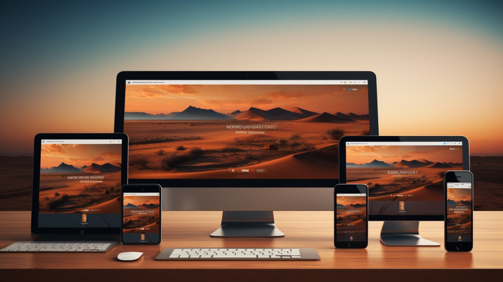
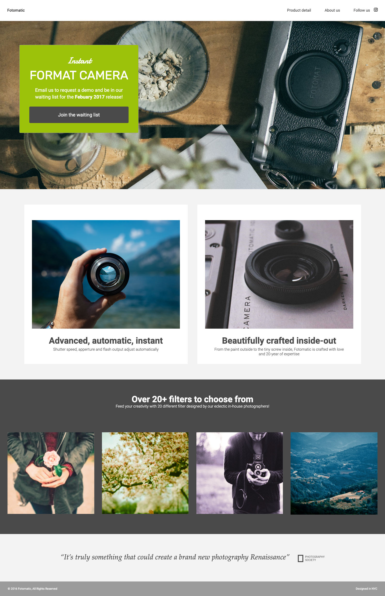

## 📸 Responsive Fotomatic

Welcome to the **Responsive Fotomatic** project! This project is part of the Codecademy curriculum, where the task is to fix and enhance the responsiveness of the Fotomatic website. Using the provided design specs, I will debug and update the site to ensure it looks great on all devices.

## 📝 Tasks

### 🧩 Fix the Header
- Align icons and buttons properly for mobile.

### ✉️ Sign Up Section
- Ensure centering and responsive padding.

### 🔍 Features Section
- Stack images and text appropriately on smaller screens.

### 🎨 Filters Section
- Align images next to each other on mobile and enable horizontal scrolling if needed.

### 📝 Quotes Section
- Center text and adjust font sizes for mobile.

### 📄 Footer
- Ensure proper alignment of footer items on mobile.

---

## 🧰 Tools
- **Chrome DevTools**
- **CSS Flexbox and Grid**
- **Media Queries**

---

## 📚 Resources

- [Chrome DevTools Documentation](https://developer.chrome.com/docs/devtools/)
- [Responsive Web Design Basics](https://developers.google.com/web/fundamentals/design-and-ux/responsive)

---

##  🚀 Result

## Author 👤

 :tada:

<!-- ALL-CONTRIBUTORS-LIST:START - Do not remove or modify this section -->
<!-- prettier-ignore-start -->
<!-- markdownlint-disable -->
<table>
  <tr>
    <td align="center"><a href="https://github.com/steguess"> <b>Stephanie Gessler</b></a> <a href="https://github.com/codesandbox/codesandbox-client/commits?author=steguess" title="Frontend Developer">💻</a></td>

